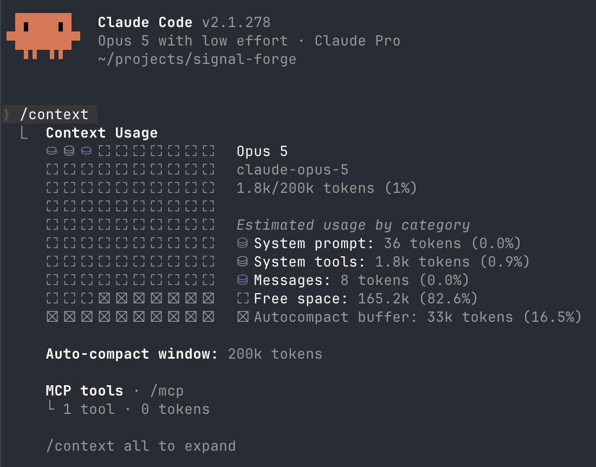

# claudecut

Run **Claude Code** with almost everything cut away.

Same CLI, same account, same login. But a session starts with one tool instead
of twenty, a 36-token system prompt instead of the default one, and a context
window capped so it compacts early instead of quietly growing into your limits.

Built for a $20 Claude Pro plan, where the thing you are actually spending is
context.



```
claudecut  ──►  Claude Code CLI  ──►  api.anthropic.com
                (unmodified)          1 tool · 36-token prompt · 200k window

claude     ──►  Claude Code CLI  ──►  api.anthropic.com
                (unmodified)          the full thing, untouched
```

- Nothing is patched, wrapped or reinstalled — these are documented CLI flags
- Your plain `claude` command keeps working exactly as before
- `claudecut --full` gives you stock Claude Code for one run
- Subcommands like `claudecut attach <id>` pass through uncut
- Presets put back exactly as much as you miss, and the bench prices each one

## What it costs

Two numbers matter, and they are different numbers.

**Session overhead** — what a session costs before doing anything, measured with
a prompt that uses no tools:

| preset | prompt tokens | what you keep |
|---|---:|---|
| `sh` | 895 | one shell tool, and nothing else |
| `sh-read` | 1,503 | shell + native file reader |
| `read-edit` | 2,087 | shell + Read, Edit, Write |
| `restricted` | 11,612 | everything that does not execute code |
| `default` | 17,625 | stock Claude Code |

**Real work** — both bench tasks against a live Bun + TypeScript repository,
three runs each:

| task | preset | cost | turns | wall | prompt |
|---|---|---:|---:|---:|---:|
| `inspect` | `sh` | **$0.0667** | 4.33 | 11.7s | 12,772 |
| `inspect` | `default` | $0.1203 | 3.67 | 16.0s | 76,275 |
| `trace` | `sh` | **$0.0565** | 4.33 | 11.7s | 10,561 |
| `trace` | `default` | $0.1174 | 5.33 | 16.3s | 103,535 |

**Roughly 2x cheaper per task, at equivalent quality.** The 20x gap in session
overhead does not carry over, because both sessions read the same files and that
content is not free under any preset. Only the overhead gets cut.

`trace` is a code-search task — find where config is loaded, quote the line,
explain the failure modes — and it is the case where native search tools were
expected to win. They did not: the cut session used *fewer* turns, because one
`rg` in a shell covers what otherwise takes a Glob, then a Grep, then a Read.
Answers matched in substance across all twelve runs, and the single most
complete one came from the cut preset.

Claude Code v2.1.278, Opus 5 at low effort. Run-to-run variance is large — the
worst `sh` run costs more than the best `default` run — so three repeats is a
trend, not statistics. Spreads, method and open questions:
[`docs/limits.md`](docs/limits.md).

## Getting started

Open a fresh Claude Code session and hand it
[`setup-prompt.md`](setup-prompt.md).

The agent checks what you already have, asks which preset you want, puts the
command on your `PATH`, generates the MCP config for your machine, verifies the
whole path end to end, and finishes by telling you which capabilities you just
gave up.

Or do it by hand — it is a symlink:

```bash
git clone https://github.com/alexgetmancom/claudecut ~/projects/claudecut
ln -s ~/projects/claudecut/bin/claudecut ~/.local/bin/claudecut
```

Then use it like Claude Code, because it is Claude Code:

```bash
claudecut
claudecut --continue
claudecut -p "explain src/index.ts"
claudecut --preset read-edit          # more tools, just this once
claudecut --full                      # stock Claude Code, just this once
claudecut --show -p hi                # print the command, run nothing
claudecut attach ab12cd34             # subcommands pass through untouched
```

## What you give up

The `sh` preset means reading, searching and editing all happen through the
shell — `cat`, `rg`, `sed`, heredocs, `git diff`. Removed with the tools:
skills, subagents, web search, the todo list and the native diff view.

Nothing warns you at runtime. `/some-skill` simply stops resolving, because
skills arrive through a tool and the tool is gone. If you want any of it back,
that is what the larger presets and `--full` are for.
[`docs/presets.md`](docs/presets.md) lists what each preset removes.

## Measuring it yourself

```bash
bench/run.sh --tasks hello                      # cheapest: overhead only
bench/run.sh --tasks inspect --repeat 3         # a real task in the current repo
bench/run.sh --presets sh,default --dir ~/code/yours
```

Each cell is a real `claude -p` run and spends real quota, so start with
`hello`. The script records cost, turns, wall time and tokens from the CLI's own
JSON output, and writes every answer to a text file next to the numbers.

It prices a preset. It does not tell you whether the answer was any good — that
part is yours to read. See [`bench/`](bench/run.sh).

## How it works

Three pieces, none of them clever:

- [`bin/claudecut`](bin/claudecut) — resolves the real `claude`, adds the
  preset's flags to an ordinary session, and hands subcommands through as typed
- [`lib/presets.sh`](lib/presets.sh) — the presets, six lines each, yours to edit
- [`mini-sh/server.mjs`](mini-sh/server.mjs) — a 60-line stdio MCP server
  exposing one tool, `sh`, whose schema is three lines long. No dependencies

It is a script rather than an alias or a settings file for a concrete reason:
`systemPrompt` and `tools` in a settings file are silently ignored by the CLI,
and an alias would put session flags in front of `attach`, where the parser
rejects them. Both verified, with repro steps, in
[`docs/findings.md`](docs/findings.md).

## Going further

[`docs/knobs.md`](docs/knobs.md) covers every other lever that moves context:
what is measured, what is unverified, and what cannot be done at all. The
single largest one is already on by default in current Claude Code — worth
knowing before you turn it off by accident.

## Requirements

macOS or Linux with bash (Windows via WSL) ·
[Claude Code CLI](https://claude.com/claude-code) · Node 18+ or Bun for the
shell server · `jq` if you want to run the benchmark

## Caveats

- **The `sh` tool runs shell commands with whatever permissions you grant it.**
  Same exposure as the built-in Bash tool, through a different door — and with
  permission prompts off, nothing stands between the model and a destructive
  command.
- **Measured on one version**, v2.1.278. Flags and defaults move between
  releases; rerun the bench rather than trusting this README.
- **Everything here is a single-shot `-p` run.** Session overhead is paid once,
  so the advantage should shrink over a long working session. That measurement
  does not exist yet and is logged as open.

## Uninstall

It writes nothing into `~/.claude`. Delete the symlink and the checkout —
[`docs/uninstall.md`](docs/uninstall.md).

## License

MIT
